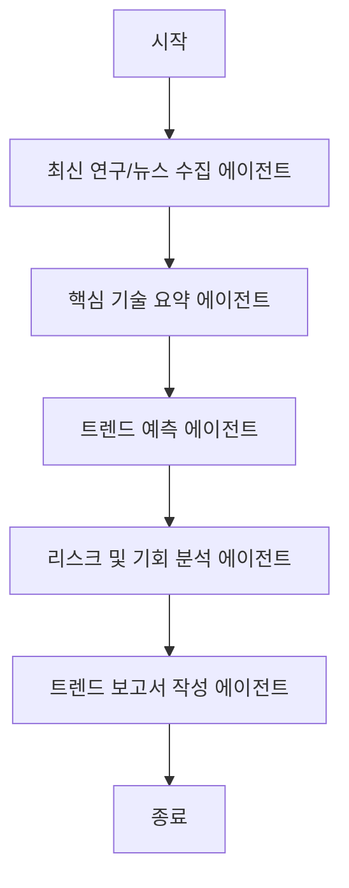

# TITLE
본 프로젝트는 AI, 로보틱스, 에너지 등 주요 미래 기술 분야의 데이터를 분석하여, 향후 5년 이내 기업들이 주목해야 할 트렌드를 예측하는 미래 기술 트렌드 분석 에이전트 시스템을 설계하고 구현한 실습 프로젝트입니다.

## Overview

- Objective : 최신 논문, 뉴스, 키워드 데이터를 수집·요약하여 미래 기술 트렌드를 예측하고 보고서를 자동 생성한다.
- Methods : 멀티 에이전트 시스템, RAG 기반 정보 보완, 프롬프트 기반 보고서 생성
- Tools : LangGraph, LangChain, Chroma, OpenAI GPT-4o API, Selenium

## Features

- 최신 연구/뉴스 기반 AI, 로보틱스, 에너지 트렌드 분석 자동화
- 시장 지표 기반 정량적 트렌드 예측 기능
- 전문가 수준의 트렌드 보고서 자동 작성 기능

## Tech Stack 

| Category   | Details                                |
|------------|----------------------------------------|
| Framework  | LangGraph, LangChain, Python, Selenium |
| LLM        | GPT-4o-mini via OpenAI API             |
| Retrieval  | Chroma                                 |

## Agents
 
- Agent A(연구/뉴스 수집 에이전트): 최근 2년간 주요 논문, 기사, 키워드 트렌드 수집
- Agent B(핵심 기술 요약 에이전트): 분야별 핵심 기술 성과 요약 및 정제
- Agent C(트렌드 예측 에이전트): 기술 발전 방향 및 시장 성장성 정량적 예측
- Agent D(리스크 및 기회 분석 에이전트): 기술별 위험 요인과 산업 적용 기회 도출
- Agent E - 보고서 생성 에이전트: 분석 결과를 종합해 구조화된 보고서 자동 생성

## State

- CollectState : 검색 키워드를 기반으로 논문/뉴스/트렌드 데이터를 수집한다.
- SummarizeState : 수집된 데이터를 기술별로 요약하고 핵심 정보를 추출한다.
- PredictState : 논문 수, 검색량 등 수치를 분석하여 기술 발전 방향과 시기 예측
- AnalyzeState : 산업별 기회, 시장 진입 장벽, 규제 위험 등을 분석한다.
- ReportState : 모든 결과를 종합하여 보고서 형식으로 구성하고 출력한다.

## Architecture

## Directory Structure
├── data/                  # 논문, 뉴스, 키워드 트렌드 JSON/CSV/PDF
├── agents/                # 평가 기준별 Agent 모듈
├── prompts/               # 보고서 및 요약용 프롬프트 템플릿
├── outputs/               # 생성된 트렌드 분석 보고서 저장
├── app.py                 # 그래프 실행 및 전체 파이프라인 제어
└── README.md

## Contributors 
- 구동빈 : Prompt Engineering, Agent Design, 전체 파이프라인 통합
