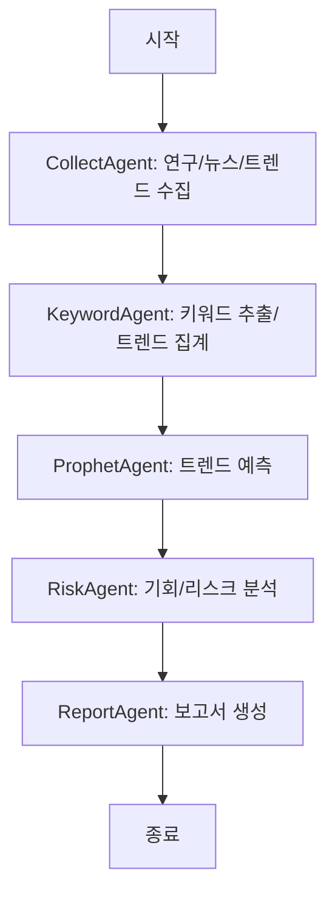

# 미래 기술 트랜드 분석
본 프로젝트는 AI, 로보틱스, 에너지 등 주요 미래 기술 분야의 데이터를 분석하여, 향후 5년 이내 기업들이 주목해야 할 트렌드를 예측하는 미래 기술 트렌드 분석 에이전트 시스템을 설계하고 구현한 실습 프로젝트입니다.

## Overview

- Objective : 최신 논문, 뉴스, 키워드 데이터를 수집·요약하여 미래 기술 트렌드를 예측하고 보고서를 자동 생성한다.
- Methods : 멀티 에이전트 시스템, RAG 기반 정보 보완, 프롬프트 기반 보고서 생성
- Tools : LangGraph, LangChain, Chroma, OpenAI GPT-4o API, Selenium

## Features

- 최신 연구/뉴스 기반 AI, 로보틱스, 에너지 트렌드 분석 자동화
- 시장 지표 기반 정량적 트렌드 예측 기능
- 전문가 수준의 트렌드 보고서 자동 작성 기능


## Tech Stack 

| Category   | Details                                |
|------------|----------------------------------------|
| Framework  | LangGraph, LangChain, Python, Selenium |
| LLM        | GPT-4o-mini via OpenAI API             |
| Retrieval  | Chroma                                 |


## Agents
- **CollectAgent** (`agent_collect.py`) : 최근 2년간 주요 논문, 뉴스, 트렌드 데이터 수집
- **KeywordAgent** (`agent_keywords.py`) : 수집 데이터에서 핵심 키워드 추출 및 트렌드 시계열 집계, 시장 이벤트 기사 카운트
- **ProphetAgent** (`agent_prophet.py`) : 추출된 키워드별 트렌드 데이터의 미래 예측 (시계열, Prophet 기반)
- **RiskAgent** (`agent_risk.py`) : 시장별 주요 기회 및 리스크 도출 (*옵션/확장 모듈*)
- **ReportAgent** (`agent_report.py`) : 전체 결과를 보고서로 자동 생성 (Markdown → PDF)


## State

| State Name            | 역할 및 설명                                                                                       | 코드 상 노드명            |
|-----------------------|---------------------------------------------------------------------------------------------------|---------------------------|
| **collect_data**      | 사용자의 질의(키워드)를 기반으로 최근 2년간 논문, 뉴스, 트렌드 데이터를 수집합니다.               | collect_data              |
| **preprocess_analyze**| 수집한 데이터를 바탕으로 분야별 핵심 키워드를 추출하고, 키워드별 시계열 집계 및 시장 이벤트도 분석합니다. | preprocess_analyze        |
| **forecast_trend**    | 추출된 키워드별로 Prophet을 활용한 미래 트렌드 예측(시계열 예측 및 그래프 생성)을 수행합니다.       | forecast_trend            |
| **risk_opportunity**  | 예측 결과 및 데이터 기반으로 산업별 주요 기회, 시장 진입장벽, 규제 등 리스크를 분석합니다.         | risk_opportunity          |
| **generate_report**   | 전체 분석 결과를 구조화된 트렌드 보고서(Markdown→PDF)로 자동 생성하고 저장합니다.                | generate_report           |


## Architecture



## Directory Structure
```
├── data/                  # 논문, 뉴스, 키워드 트렌드 JSON/CSV/PDF
├── agents/                # 평가 기준별 Agent 모듈
├── prompts/               # 보고서 및 요약용 프롬프트 템플릿
├── outputs/               # 생성된 트렌드 분석 보고서 저장
├── app.py                 # 그래프 실행 및 전체 파이프라인 제어
└── README.md
```

## Contributors 
- 구동빈 : Prompt Engineering, Agent Design, 전체 파이프라인 통합
